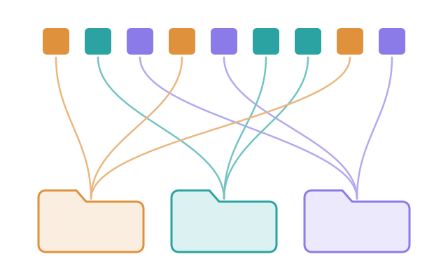
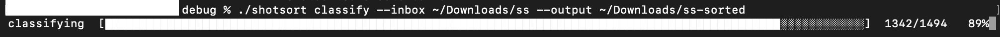
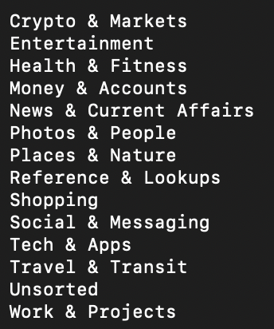

<p align="center">
  
</p>

<h1 align="center">shotsort</h1>

<p align="center">
  <strong>Sort a flat pile of screenshots into content-derived folders — entirely on-device.</strong>
</p>

<p align="center">
  <a href="https://www.apple.com/macos/"></a>
  <a href="https://swift.org"></a>
  <a href="LICENSE"></a>
</p>

shotsort reads each screenshot with Apple's **Vision** framework (OCR text, scene
labels, face geometry), proposes a folder taxonomy with Apple's on-device
**FoundationModels**, lets you edit that taxonomy by hand, classifies every image
against it, and moves files into category folders — reversibly.

It was written for a real collection: 1,494 Android screenshots, ~995 MB, spanning
15 months, in a single flat directory.

## No network, anywhere

This is the tool's strongest constraint, and it is structural rather than a setting:
**there is no networking code in shotsort.** Vision and FoundationModels both run
locally on Apple silicon. The collection that motivated the tool contains video
calls, family photos and banking screens; sending any of it to a server — or
committing a sample of it to a git repository — was ruled out at design time. The
committed test fixtures are synthetic images, never real screenshots.

## Status

Working end to end, and honest about what it is. `extract` and `apply` are solid:
extraction is resumable and has run the full 1,494-image collection to completion,
and `apply` is a dry run by default, moves by same-volume rename, and is fully
reversible with `undo`.

**Classification is a rough first pass, not a filing system.** Apple's on-device
model is measurably unstable at single-label classification — asked the same
question twice about the same screenshot, it agrees with itself about **44%** of
the time across 16 categories (chance is ~6%, so this is real signal, just not a
commitment). Group-level classification recovers most of what matters in practice
— see [Accuracy, measured](#accuracy-measured) before you run `apply --commit` on
anything you care about.

## Requirements

- **macOS 26 or later** on Apple silicon
- **Apple Intelligence enabled** in System Settings (`propose` and `classify` fail
  fast at startup with a specific reason if it is not)
- **Swift 6.2+** toolchain (Xcode 26 SDK) to build

No third-party dependencies. The package builds a single binary.

## Install

```sh
git clone https://github.com/davotoula/shotsort.git
cd shotsort
swift build -c release
sudo install .build/release/shotsort /usr/local/bin/   # or copy anywhere on your PATH
```

## Quick start

```sh
# 1. cd into the folder that holds the PNG screenshots
cd path/to/screenshots

# 2. Read every image once (OCR, scene, faces). Resumable.
shotsort extract --supervise

# 3. Get a taxonomy — either propose one from your own content...
shotsort propose
#    ...or start from the bundled one and skip straight to step 4:
#    mkdir -p ss-sorted/.shotsort
#    cp /path/to/repo/taxonomy.example.json ss-sorted/.shotsort/taxonomy.json

# 4. Edit the categories by hand — this is the intended workflow, not a fallback
$EDITOR ss-sorted/.shotsort/taxonomy.json

# 5. Assign a category to every screenshot
shotsort classify

# 6. See what would move (dry run), then actually move it
shotsort apply
shotsort apply --commit

# Changed your mind? Everything goes back to the inbox.
shotsort undo
```

Run `undo` before relocating a sorted collection, not after — the manifest
records absolute paths, so moving or remounting the tree first breaks `undo`
silently.

Everything defaults to the current directory: the inbox is `.`, output and
state live in `./ss-sorted/`. Point the tool elsewhere with
`--inbox PATH` and/or `--output PATH` — every command accepts both, and an
explicit `--inbox` anchors the default output under it. Because the inbox
defaults to wherever you are, check your directory before
`apply --commit` — `apply` alone is a dry run, and `undo` reverses a
commit. Collections sorted by an earlier shotsort live wherever its
hardcoded paths put them (`~/Downloads/ss` and `~/Downloads/ss-sorted`):
pass `--inbox`/`--output` explicitly, or `cd` to where the collection
lives.

Try it on a subset first: `shotsort classify --limit 50 --verify` classifies 50
records and reports how often a re-ask agrees with the first answer. That number,
not the folder histogram, is the honest signal about whether your taxonomy works.

## What it looks like

`classify` resuming a partly-done collection — the bar opens where the last run
stopped, not at zero, because labels are append-only and reused:

<p align="center">
  
</p>

The categories those 1,494 screenshots land in. These are the names from
[`taxonomy.example.json`](taxonomy.example.json) — `propose` drafts a set like
this from your own content, and you edit it by hand before classifying:

<p align="center">
  
</p>

Each becomes a folder under the output directory, plus `Unsorted` for anything
the classifier will not commit to.

## How it works

Four stages, each resumable, each writing append-only JSONL so being killed
partway through costs nothing:

| Stage | What it does | On-device AI |
|---|---|---|
| `extract` | Three Vision requests per image: OCR text, scene classification, face rectangles. Appends one record to `index.jsonl`, keyed by name + mtime + size. | Vision (no LLM) |
| `propose` | Clusters the index by deterministic signals, samples ≤120 representatives, and asks the model for category names. Writes `taxonomy.json`. | FoundationModels |
| `classify` | Groups screenshots sharing real evidence (a domain, a named scene) and decides each group with **one** model call, stamping every member. Ungrouped images are decided individually. | FoundationModels |
| `apply` | Dry run by default. With `--commit`, moves files by same-volume rename and logs every move to `manifest.jsonl`. | none |

### Runtime, measured

All figures from one machine: **MacBook Pro, Apple M1 Pro, 16 GB, macOS 26**,
against the 1,494-image / ~995 MB collection. Apple Silicon generation and memory
both matter — the model runs on the Neural Engine, and `extract` is capped at two
concurrent Vision requests regardless of core count.

| Stage | Wall clock | What sets it |
|---|---|---|
| `extract` | **~5 min** | Vision, capped at 2 concurrent requests. Scales with image count, not content. |
| `propose` | **~1–2 min** | Fixed work: ≤120 sampled representatives, then one reduction call. Barely grows with collection size. |
| `classify` | **~40–60 min** | Model calls, not images — see below. |
| `apply` | **seconds** | `rename(2)` per file, same volume. |

`classify` is the one that varies, because its unit is the model call, not the
screenshot. A warm call takes **~4s**; a group decides every one of its members in
that single call, while an ungrouped image costs a whole call to itself. So the
per-image rate is not constant through a run — groups drain first and are cheap
per image, singles drain last at roughly one call each. Measured at the singles
end of a run, throughput drops to 8–13s per image; that is the floor, not the
average, and multiplying it across a whole collection overstates the total.

Two smaller costs worth expecting:

- **~6–10s of model cold start per invocation**, paid before the first result and
  again on every restart. Interrupting and resuming a long `classify` is cheap in
  work but not free in latency.
- **The bar can sit still for 30–75s at the start** while the first group resolves,
  because progress only advances when a whole unit completes. It is not stuck.
  See `TODO.md` item 12.

Two design choices are worth knowing about because they shape the output:

**Raw capture, derived filtering.** Vision returns 1,303 scene identifiers with
confidences for *every* image, so "has a scene label" is meaningless as-is. The
unfiltered top-20 goes into the index; the useful `scenes` field is derived at read
time. Recalibrating the confidence floor or the generic-label denylist therefore
costs no re-extraction — change the constants, re-run `propose` and `classify`
against the untouched index.

**Groups, not images.** Classifying each screenshot alone was measured and
rejected: six `accuweather.com` screenshots landed in six different categories,
because the model reacts to whatever text happens to be in each one. Deciding a
group once and stamping every member makes same-source screenshots consistent by
construction. A wrong group label is repairable by renaming one folder; a scattered
one is not.

## Why it isn't one shot

A sorter that ran end to end in one command would have to invent the folder
names **and** file every screenshot into them before you had seen a single
name. The pipeline has seams because two of its moments belong to you:

- **Edit `taxonomy.json`** — after `propose`, before `classify`. Reviewing
  fifteen category names costs minutes; reclassifying a collection against
  names you should have fixed costs hours. The seam puts your judgment at the
  cheap point.
- **Read the dry run** — after `classify`, before `apply --commit`. Moving
  files is the only step that cannot be un-crashed, so it is the last,
  simplest, fastest one — previewable first, reversible after.

Three more reasons the stages stay separate:

1. **Failure isolation.** Both Apple frameworks this rides on misbehave under
   load — Vision segfaults under concurrency (see `--supervise`), and
   FoundationModels sporadically parks a request for minutes (contained by a
   per-call watchdog that abandons and retries). Every stage writes
   append-only state, so a crash at image 1,200 resumes at 1,201; a monolith
   would lose the run.
2. **Cost asymmetry.** OCR is expensive but taxonomy-independent: run once,
   valid forever. Classification is cheaper but taxonomy-dependent. Keeping
   them apart means changing your mind about categories re-runs only
   classification, never extraction.
3. **The loop is the workflow.** `undo` → edit → `classify` → `apply` is the
   documented way to iterate on categories until they fit. A one-shot tool
   cannot iterate — it can only be re-run from scratch.

Once a taxonomy you trust exists, the routine run is one shot in spirit —
`extract && classify && apply --commit`, no stops.

## Commands

```
shotsort <extract|diagnose|propose|classify|apply|undo>
    [--inbox PATH] [--output PATH] [flags]
```

`--inbox` (default `.`) and `--output` (default `<inbox>/ss-sorted`) apply
to every command.

| Command | Flags | Notes |
|---|---|---|
| `extract` | `--concurrency N` (default 2), `--supervise` | See [the Vision crash](#a-note-on---supervise) below |
| `diagnose` | — | Prints filter constants and signal coverage over the index. Use it to calibrate before re-running `propose`. |
| `propose` | — | Overwrites `taxonomy.json`. Warns on stderr if model consolidation failed and the draft is an unconsolidated fallback. |
| `classify` | `--verify`, `--limit N` | `--verify` re-asks each record with different phrasing and records whether the two answers agree. Roughly doubles the runtime. |
| `apply` | `--commit` | **Dry run without `--commit`.** Refuses to run if inbox and output are on different volumes. |
| `undo` | — | Appends compensating `revert` records and returns every file to the inbox. |

### A note on `--supervise`

Apple's Vision framework segfaults under concurrent load — the crash is inside
`TextRecognition`, reproducible with no project code involved, and traceable to the
Apple Neural Engine's session limit of 2. Measured over the full collection: width
1 and 2 survive, 4 and 8 crash. The default is therefore 2.

A cap makes the crash unlikely, not impossible, because the race is in Apple's
code. `--supervise` re-invokes the binary as a child until extraction completes,
and distinguishes *crashed but made progress* (restart) from *crashed with no
progress* (stuck on one specific image — report it and stop), so a poisoned file
can never masquerade as the flaky framework bug. The evidence — crash signatures,
the widths tested, and what ruled out a poisoned image — is in
[`TODO.md`](TODO.md) item 1.

## Layout

```
./                                  the inbox — flat, empties as sorting proceeds
./ss-sorted/
    .shotsort/
        index.jsonl                 one record per extracted image
        taxonomy.json               your categories — hand-edited
        labels.jsonl                one row per classification
        manifest.jsonl              every move and every revert
    News & Current Affairs/
    Crypto & Markets/
    Unsorted/
```

Sorting moves files out of the flat top level — into `ss-sorted/`, which by
default sits inside the inbox, and that nesting is safe because the scan is
shallow: `extract` lists the inbox with a non-recursive directory read and
never descends into subdirectories, so anything at the flat top level is by
definition unsorted and anything already filed is invisible to it. Both trees
must be on the same volume; `apply` verifies this at startup and refuses to
run rather than degrading to copy-and-unlink.

These are the defaults — `--inbox` and `--output` move either tree.

## The taxonomy

`taxonomy.json` is the one file you are expected to edit. `propose` writes a draft;
you rename, merge and delete until the categories are crisply disjoint. Category
descriptions are shown to the classifier, so they are prompt material, not
comments — "Not news articles" on a Social category does real work.

[`taxonomy.example.json`](taxonomy.example.json) is a 14-category starting point
derived from the original collection.

Names become folder names, so they are validated on load and **rejected rather than
rewritten**: no `/` or `:`, no leading dot, not `.shotsort`, no leading or trailing
whitespace, 64 characters max, and no collision with another name case-insensitively
or under Unicode normalisation (APFS treats NFC and NFD `Malmö` as one directory).
`Unsorted` must be present.

Editing the taxonomy invalidates labels produced against the old one — `classify`
detects the change and re-runs those records rather than silently applying stale
answers. The full loop is `undo` → edit → `classify` → `apply`, with no
re-extraction, because `rename(2)` preserves mtime and the index key still matches.

### Reusing an earlier `classify`

`classify` is the expensive stage — roughly 40–60 minutes for 1,500 images (see
[Runtime](#runtime-measured)). Re-running it does **not** repeat that work: labels live in
append-only `labels.jsonl`, newest row per file wins, and a label is reused when
it was produced against both the current taxonomy and the current
`filterVersion`. So `shotsort classify` on an unchanged taxonomy is close to
free, and interrupting a run costs at most the group in flight — labels are
written one `appendAll` per group, so a kill never leaves a group half-labelled.

**Adding screenshots later.** The intended steady-state loop: drop new PNGs into
the inbox and run the four stages again.

```sh
shotsort extract     # indexes only the new files (resume key is name+mtime+size)
shotsort classify    # classifies only the unlabelled ones
shotsort apply --commit
```

New files sort into the existing category folders, and already-filed images are
left alone — `apply` recognises a file already in its correct category and skips
it.

One thing to expect: this is incremental in cost but not strictly additive in
effect. Images are classified in groups that share a domain, a group is due when
*any* member needs a label, and deciding it rewrites the label for every member.
So a new screenshot joining an established group re-decides that whole group with
the new image as extra evidence, and if the verdict changes, `apply` moves those
already-filed images to the new category rather than leaving them inconsistent.
Usually that is an improvement — more evidence, better call — but it does mean a
small drop can reshuffle files you had already sorted.

What counts as "changed" is narrower than the file, and cuts both ways. The
signature is a digest of the **category names only** — not their descriptions,
not their examples:

| edit to `taxonomy.json` | reclassified |
|---|---|
| reword a `desc`, change `examples` | **nothing** |
| reorder categories | nothing — names are sorted before hashing |
| add, remove or rename a category | **the whole collection** |
| bump `filterVersion` | the whole collection |

Both surprising rows matter. Descriptions are prompt material, so rewording one
changes what the classifier *would* answer while `classify` reports nothing to
do — your labels stay consistent with the old wording, and re-running will not
refresh them. Conversely a one-character rename to fix a typo invalidates every
label in the collection, and there is no flag to override that. If you are
tuning descriptions, do it before the first full run, not after.

## Accuracy, measured

Every number here came from running the tool on the real 1,494-image collection.
They are in the README because the failure mode of a tool like this is looking
successful: a plausible folder histogram tells you nothing about whether the
assignments are stable.

| Measurement | Result |
|---|---|
| Same-prompt agreement, asked twice, 16 categories | **44%** (chance ≈ 6%) |
| Same-prompt agreement, 7 categories | 51% (chance ≈ 14% — shrinking the taxonomy is not a fix) |
| Different-phrasing agreement (`--verify`), 16 categories | 26% |
| Same-source consistency, grouped domains (≥3 screenshots) | **19/19** domains get one category |
| Same-source consistency, before grouping | 3/20 |
| `Unsorted` share of the collection | 13% |

**What this means in practice.** The model knows roughly what a screenshot is
about; it will not commit to one label. Grouping is what makes the output usable:
all seven `primal.net` screenshots land together whether or not the category chosen
for them is the one you would have picked, and one folder rename repairs a bad
group call. Ungrouped, low-signal images remain inconsistent, and `Unsorted` is an
honest destination for them.

Two things were tried and rejected as fixes: tuning the taxonomy (two taxonomies,
consistency went 15% → 7% — the unit was wrong, not the vocabulary) and rule-based
sorting on harvested domains (326 domain-bearing records spread across a ~200-domain
long tail; 35 of 55 multi-record domains legitimately split across categories).

A structural gate handles the genuinely hopeless cases without consulting the model
at all: fewer than 12 characters of text **and** no domains **and** no significant
face area **and** no scene labels goes straight to `Unsorted`. Self-reported model
confidence is recorded but nothing branches on it — a small model's confidence
clusters at 0.8–0.9 almost regardless of evidence, and a threshold that never fires
is worse than no threshold because it reads as a safety mechanism.

## Known limitations

- **PNG only.** Other image formats in the inbox are ignored silently.
- **Single-label.** A banking screenshot shared on social media really is two
  things; the folder-per-image premise forces a choice.
- **English-leaning OCR.** Vision handles multilingual text, but the taxonomy and
  prompts were tuned against a mostly-English collection.
- **No search or retrieval**, no near-duplicate detection, no background automation.
  All three are explicitly out of scope.

The full backlog, including measurements that closed items and deferred review
findings, is in [`TODO.md`](TODO.md).

## Development

```sh
swift build          # debug build
swift test           # 202 tests, no model or network required
swift build -c release
```

Tests run against synthetic fixtures in `fixtures/synthetic/`
(regenerate with `fixtures/synthetic/make_fixtures.swift`). `fixtures/local/` is
git-ignored for ad-hoc testing against real screenshots; nothing there is ever
committed and no test depends on it.

```
Sources/ShotsortCore/
    Extract/    Vision requests, timestamp parsing, domain harvesting
    Scene/      SceneFilter, face bands, signal lines — pure functions over data
    Propose/    clustering, stratified sampling, the proposer
    Classify/   group planning, the classifier, the no-signal gate
    Apply/      net-state resolution, volume check, move and undo
    Store/      append-only JSONL, taxonomy load and validation
Sources/shotsort/main.swift    CLI wiring and the extract supervisor
```

Dependencies point one way. `Applier` — the only component that can lose data —
knows nothing about Vision or the language model; it consumes `labels.jsonl` and is
tested against fixture JSON on temporary directories.

### Where the reasoning lives

There is no separate design folder. Decisions are recorded in the two places
that cannot drift from the code:

- **Doc comments, at the declaration they explain.** They carry the *why*, the
  alternative rejected, and the measurement where one exists — `Taxonomy.signature`
  on why it is SHA-256 and not `hashValue`, `ModelWatchdog` on why the race is
  unstructured, `ProgressReporter` on why the resize walk is safe to compute.
  Density is deliberate; see CONTRIBUTING.md.
- **[`TODO.md`](TODO.md)** — open items, and the measurements that closed the
  rest. Anything found by *using* the tool goes here, with its numbers.

## Contributing

Issues and pull requests are welcome — see [CONTRIBUTING.md](CONTRIBUTING.md) for
the full guide. The three things that will come up in review:

1. **You must have run the binary**, not just the tests. A green suite does not
   tell you a change here works: per-image classification once produced a
   perfectly plausible folder histogram at 7% same-source consistency, and every
   test passed. Paste the output of the stages your change touches.
2. **Measurements beat opinions.** Most claims in this repository carry a number
   next to them because most of the interesting bugs looked like successes. Say
   what you measured and on how many records.
3. **Never commit real screenshots.** Fixtures are synthetic by design — the
   privacy constraint that forbids network calls forbids this too. That applies to
   screenshots posted in a pull request as well; redact before you attach.

## License

MIT — see [LICENSE](LICENSE).
